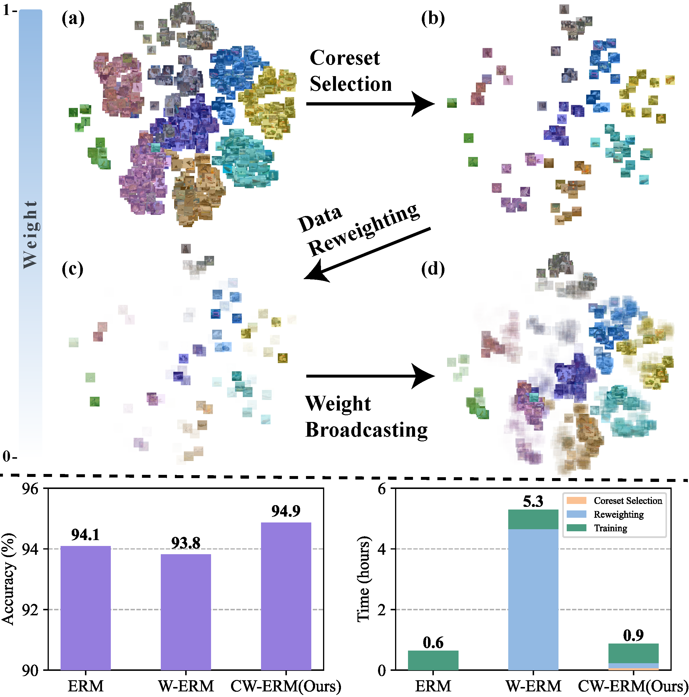

# The Power of Few: Accelerating and Enhancing Data Reweighting with Coreset Selection



Welcome to the official implementation of our ICASSP 2024 paper, **"The Power of Few: Accelerating and Enhancing Data Reweighting with Coreset Selection"**. This work introduces an innovative method that synergistically combines coreset selection and data reweighting techniques to enhance machine learning performance while maintaining computational efficiency.

**Links:**
- [](https://arxiv.org/abs/2403.12166)
- [](https://mohammadjafari80.github.io/CoresetReweightedERM/ICASSP-POSTER-vertical-final.png)
- [](https://mohammadjafari80.github.io/CoresetReweightedERM/)

## Abstract
As machine learning tasks continue to evolve, the trend has been to gather larger datasets and train increasingly larger models. While this has led to advancements in accuracy, it has also escalated computational costs to unsustainable levels. Addressing this, our work aims to strike a delicate balance between computational efficiency and model accuracy, a persisting challenge in the field. We introduce a novel method that employs core subset selection for reweighting, effectively optimizing both computational time and model performance. By focusing on a strategically selected coreset, our approach offers a robust representation, as it efficiently minimizes the influence of outliers. The re-calibrated weights are then mapped back to and propagated across the entire dataset. Our experimental results substantiate the effectiveness of this approach, underscoring its potential as a scalable and precise solution for model training.

## Requirements

To install the necessary Python packages, use the following command:

```shell
pip install -r requirements.txt
```

We recommend installing the packages in a new environment:

```shell
conda create -n cwerm
conda activate cwerm
pip install -r requirements.txt
```

## Datasets

Our experiments are conducted on two widely-used datasets: CIFAR-10 and CIFAR-100. The code can be easily extended to other datasets. Refer to `data.py` for instructions on adding new datasets.

## Experiments

We utilize the [Moderate Coreset Selection](https://github.com/tmllab/2023_ICLR_Moderate-DS) technique to select an informative subset of data and [Meta-Weight-Net](https://github.com/xjtushujun/meta-weight-net) for data reweighting. The code is designed in a modular fashion, allowing you to apply different coreset selection methods and data reweighting techniques by updating the `--coreset-method` and `--weighting-method` parameters in `args.py`.

Key arguments for running the code include `--dataset`, `--coreset-ratio`, and `--broadcast-weights`. You can execute `main.py` with the desired arguments as shown in the example below:

```shell
python main.py --dataset cifar10 --coreset-method moderate_selection --weighting-method meta_weight_net --coreset-ratio 0.01 --broadcast-weights True
```

Each result reported in our paper is averaged over at least five individual runs to ensure robustness.

## Citation

If you find our work useful in your research, please cite our paper as follows:

```
@INPROCEEDINGS{10447623,
  author={Jafari, Mohammad and Zhang, Yimeng and Zhang, Yihua and Liu, Sijia},
  booktitle={ICASSP 2024 - 2024 IEEE International Conference on Acoustics, Speech and Signal Processing (ICASSP)}, 
  title={The Power of Few: Accelerating and Enhancing Data Reweighting with Coreset Selection}, 
  year={2024},
  pages={7100-7104},
  keywords={Training;Computational modeling;Scalability;Focusing;Machine learning;Signal processing;Market research;coreset selection;data reweighting},
  doi={10.1109/ICASSP48485.2024.10447623}}
```

## Acknowledgments

This codebase heavily builds upon the [Moderate Coreset Selection](https://github.com/tmllab/2023_ICLR_Moderate-DS) and [Meta-Weight-Net](https://github.com/xjtushujun/meta-weight-net) projects. We extend our gratitude to the developers of these frameworks.

For any questions or issues, please email [mamad.jafar91@gmail.com](mailto:mamad.jafar91@gmail.com). Thank you for using our implementation!